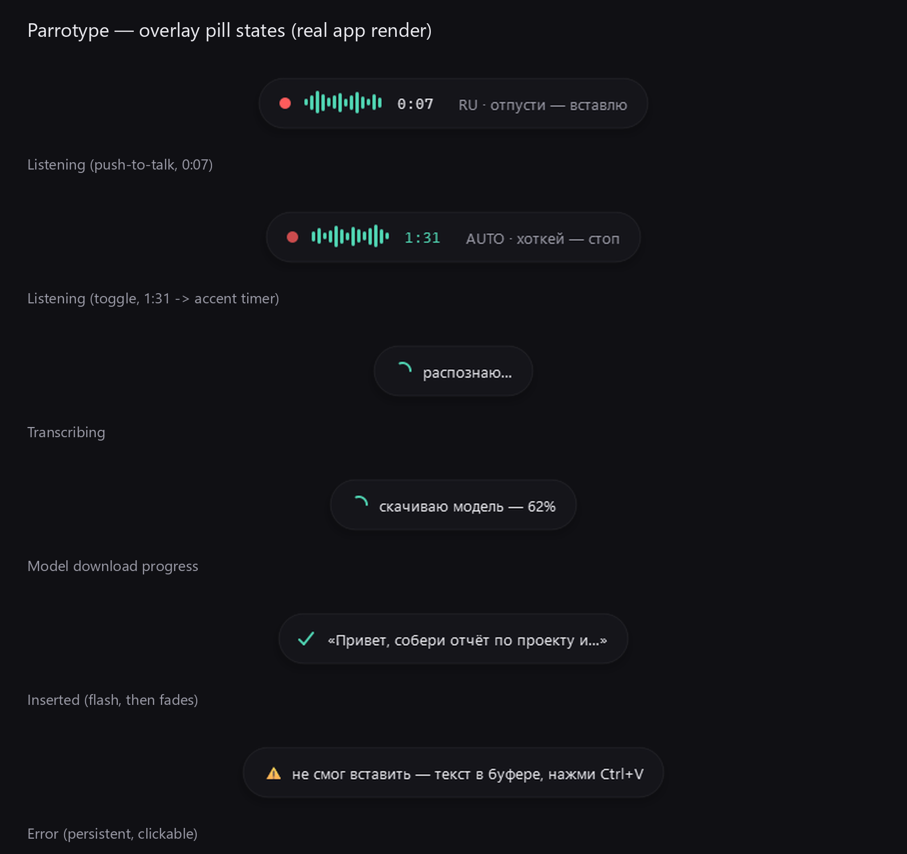

<p align="center">
  
</p>

<h1 align="center">Parrotype</h1>

<p align="center"><em>You talk. The parrot types.</em></p>

<p align="center">Voice dictation for Windows that runs entirely on your machine. Free, no account, no cloud.</p>

<!-- активируется при публикации: GitHub Pages (Settings -> Pages -> Source: GitHub Actions) -->
<p align="center"><a href="https://yorxenhq.github.io/parrotype/">Website</a> · <a href="https://yorxenhq.github.io/parrotype/guide.html">Guide</a></p>

<p align="center">
  <a href="https://github.com/yorxenhq/parrotype/releases/latest"></a>
  <a href="LICENSE"></a>
  
  <a href="https://github.com/yorxenhq/parrotype/releases"></a>
</p>

<p align="center">
  
</p>

Hold a hotkey, say what you want, release — the text lands in whatever window you're in. That's the whole app.

## Why Parrotype

- **Private by construction.** Recognition runs on your machine, on a local Whisper model. Your voice and your text go nowhere — not even to us.
- **Fast.** A 13-second phrase transcribes in about 0.8 s on a laptop GPU, a couple of seconds on CPU ([measured](scripts/benchmark.py)).
- **14 languages that actually work.** Each one passed a measured recognition gate before it made the menu. Auto-detect handles the rest.
- **Knows your words.** A replacement dictionary teaches it your terms — "kubernetes", product names, people. Say it once, it's typed right.
- **Doesn't eat your clipboard.** Text is pasted into the active window, then whatever you had copied comes back.
- **Free. Actually free.** MIT license, no trial, no pro tier. It stays that way.

## Install

1. Download [ParrotypeSetup.exe](https://github.com/yorxenhq/parrotype/releases/latest/download/ParrotypeSetup.exe) from the [latest release](https://github.com/yorxenhq/parrotype/releases/latest).
2. Run it. Windows SmartScreen will warn about an unknown publisher — the installer isn't code-signed yet. "More info" → "Run anyway", or build from source below if you'd rather trust the code than us.
3. First run opens a three-step wizard: check your microphone, pick a model (it downloads on the spot, ~75 MB to ~3 GB depending on the model), try the hotkey.

Then hold `Ctrl+Alt` anywhere and speak. `Ctrl+Shift+Space` toggles hands-free mode.

## Languages

English, Russian, Spanish, German, French, Italian, Portuguese, Polish, Ukrainian, Dutch, Turkish, Japanese, Korean, Chinese — each passed a measured recognition-quality gate on the production engine ([per-language results](design/preview/lang-gate.md)). Auto-detect covers the 90+ languages Whisper knows; that part is Whisper's promise, not ours.

UI languages: English and Russian, follows your system.

## Privacy

Everything happens on this computer. Your voice and your text go nowhere — not even to us.

The app touches the network for exactly two things: downloading the Whisper model on first run, and an optional weekly check for a new version, which you can switch off in settings. The dictation core contains no network code at all — clone the repo and see for yourself:

```
grep -rniE "http|socket|urllib|requests" core/
```

Nothing comes back.

## Support

Parrotype is free and stays free. If it saves you time, you can [buy Eugene a coffee](https://ko-fi.com/eugene_vovk) — it keeps the parrot fed.

---

<details>
<summary><b>Build from source</b></summary>

```powershell
git clone https://github.com/yorxenhq/parrotype && cd parrotype
python -m venv .venv && .venv\Scripts\pip install -r requirements.txt
.venv\Scripts\python -m shells.tray                              # tray app
.venv\Scripts\python -m shells.cli tests\data\test_en.wav        # or just transcribe a file
```

GPU (NVIDIA): the installed app offers a one-click CUDA runtime download when it sees your graphics card (Settings → Model), so the installer itself stays small. From source: `.venv\Scripts\pip install nvidia-cublas-cu12 nvidia-cudnn-cu12`.

Build the installer yourself:

```powershell
.venv\Scripts\python -m PyInstaller packaging\parrotype.spec --noconfirm   # -> dist\Parrotype\
ISCC.exe packaging\installer.iss                                           # -> dist\ParrotypeSetup.exe (Inno Setup 6)
```

</details>

<details>
<summary><b>Run tests</b></summary>

```powershell
.venv\Scripts\pip install -r requirements-dev.txt
.venv\Scripts\python -m pytest tests
```

72 unit and integration tests: config, history, dictionary post-filter, update check, reliability guards, and end-to-end STT on real model output. Beyond pytest, `scripts/selftest_*.py` boot the actual tray app headless, drive the real Windows keyboard hook with injected input, and paste into a live Notepad.

</details>

<details>
<summary><b>Tech notes</b></summary>

- Engine: [faster-whisper](https://github.com/SYSTRAN/faster-whisper), 16 kHz mono capture via sounddevice. CUDA when available, automatic CPU fallback. The decode runs in an isolated worker process — a native crash restarts the worker, never the app.
- UI: PySide6 tray app. The overlay pill never steals focus and is click-through; Esc cancels a recording.
- Default model: `large-v3-turbo` on GPU (0.78 s for a 13.5 s phrase on an RTX 4050 laptop), `small` on CPU. Settings has a built-in latency test — measure on your own machine and pick.
- Config and history live in `%APPDATA%\Parrotype`. History is local, capped at the last 50 dictations, and can be turned off.
- Repo map: `core/` — the engine, importable as a library; `shells/tray/` — the app; `shells/cli/` — stdout transcription; `packaging/` — PyInstaller spec + Inno Setup script. Non-obvious calls are written down in [DECISIONS.md](DECISIONS.md).
- License: MIT. Dependency licenses audited in [LICENSES.md](LICENSES.md).

</details>
